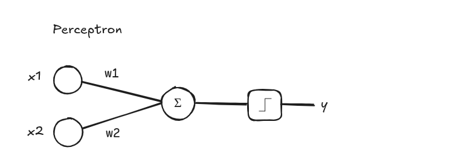

# GO Perceptron



A simple implementation of Perceptron in golang

### 📋 About

Dataset: https://www.kaggle.com/datasets/uciml/iris

To train the model, only SepalLengthCm and SepalWidthCm columns were used

### 🔧 Run

```
go run main.go
```

### Expected Output ###

SepalLength = 4.8 \
SepalWidth = 3.4 \

SepalLength = 6.4 \
SepalWidth = 3.2 \

```
Expected Class: Setosa
Output Class: Setosa


Expected Class: Versicolor
Output Class: Versicolor
```
